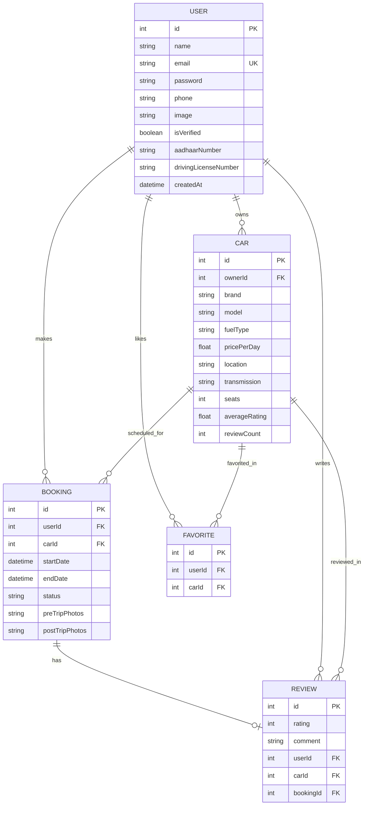

# Entity Relationship Diagram – ZoomCar

```mermaid
erDiagram

USER {
    int id PK
    string name
    string email UK
    string password
    string phone
    string image
    boolean isVerified
    string aadhaarNumber
    string drivingLicenseNumber
    datetime createdAt
}

CAR {
    int id PK
    int ownerId FK
    string brand
    string model
    string fuelType
    float pricePerDay
    string location
    string transmission
    int seats
    float averageRating
    int reviewCount
}

BOOKING {
    int id PK
    int userId FK
    int carId FK
    datetime startDate
    datetime endDate
    string status
    string preTripPhotos
    string postTripPhotos
}

REVIEW {
    int id PK
    int rating
    string comment
    int userId FK
    int carId FK
    int bookingId FK
}

FAVORITE {
    int id PK
    int userId FK
    int carId FK
}

USER ||--o{ CAR : owns
USER ||--o{ BOOKING : makes
CAR ||--o{ BOOKING : scheduled_for
BOOKING ||--o| REVIEW : has
USER ||--o{ REVIEW : writes
CAR ||--o{ REVIEW : reviewed_in
USER ||--o{ FAVORITE : likes
CAR ||--o{ FAVORITE : favorited_in
```
