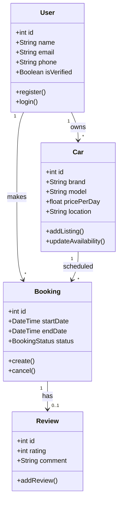

# Class Diagram – ZoomCar

```mermaid
classDiagram

class User {
    +int id
    +String name
    +String email
    +String phone
    +Boolean isVerified
    +register()
    +login()
}

class Car {
    +int id
    +String brand
    +String model
    +float pricePerDay
    +String location
    +addListing()
    +updateAvailability()
}

class Booking {
    +int id
    +DateTime startDate
    +DateTime endDate
    +BookingStatus status
    +create()
    +cancel()
}

class Review {
    +int id
    +int rating
    +String comment
    +addReview()
}

User "1" --> "*" Car : owns
User "1" --> "*" Booking : makes
Car "1" --> "*" Booking : scheduled
Booking "1" --> "0..1" Review : has
```
