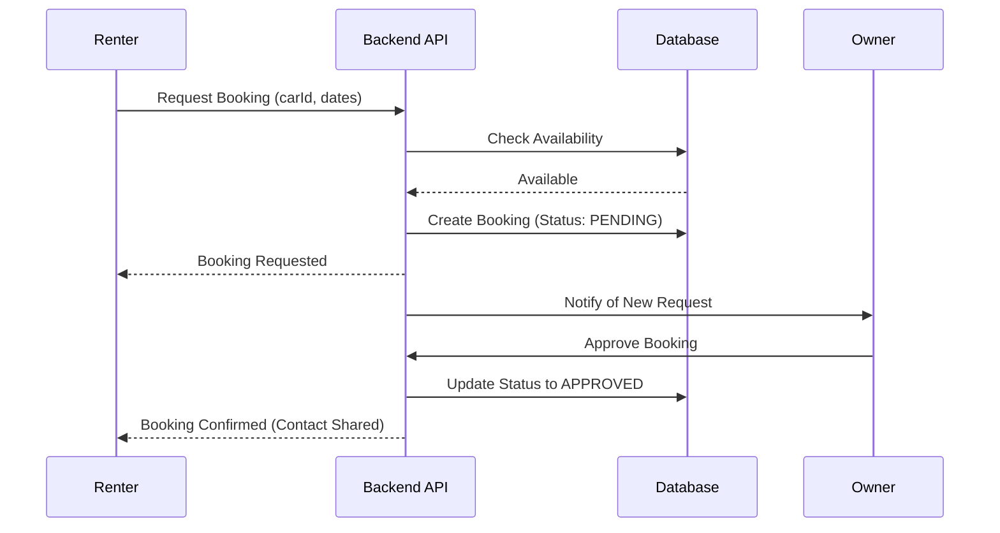

# Sequence Diagram – Booking Flow (ZoomCar)

```mermaid
sequenceDiagram

participant R as Renter
participant API as Backend API
participant DB as Database
participant O as Owner

R->>API: Request Booking (carId, dates)
API->>DB: Check Availability
DB-->>API: Available

API->>DB: Create Booking (Status: PENDING)
API-->>R: Booking Requested

API->>O: Notify of New Request
O->>API: Approve Booking

API->>DB: Update Status to APPROVED
API-->>R: Booking Confirmed (Contact Shared)
```
