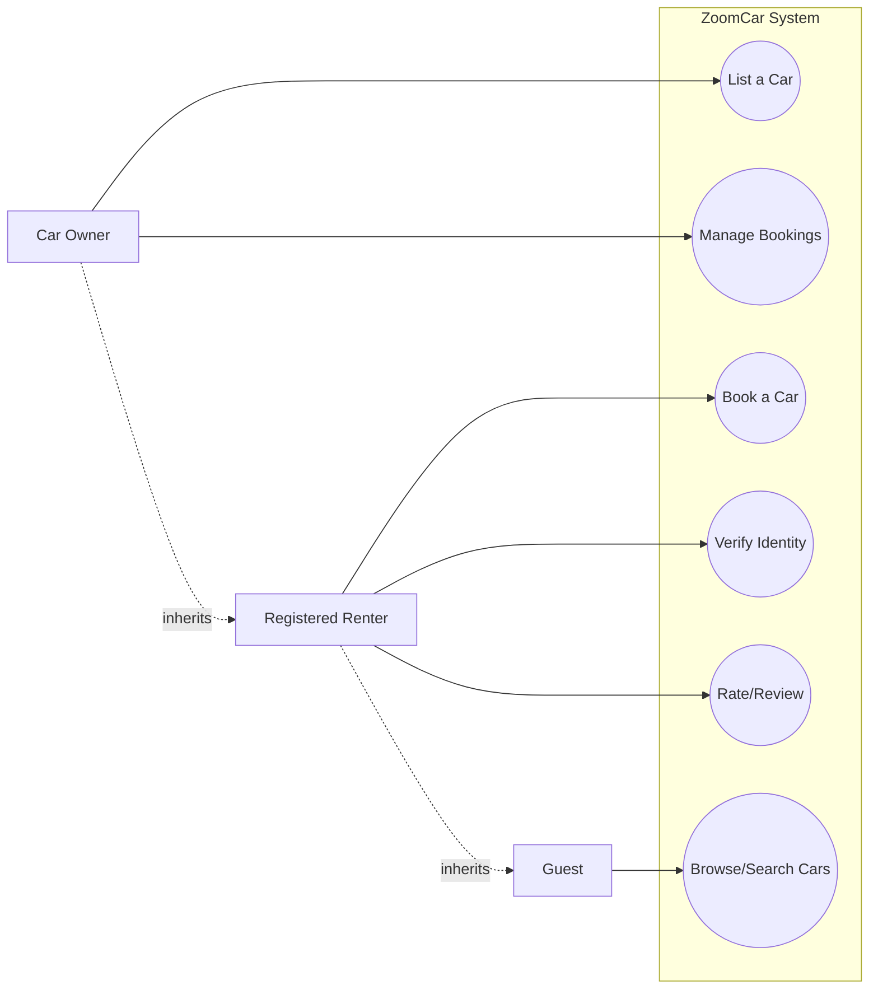

# Use Case Diagram – ZoomCar

```mermaid
flowchart LR

    %% Actors
    G[Guest]
    R[Registered Renter]
    O[Car Owner]

    %% System Boundary
    subgraph ZoomCar System
        UC1((Browse/Search Cars))
        UC2((Book a Car))
        UC3((Verify Identity))
        UC4((List a Car))
        UC5((Manage Bookings))
        UC6((Rate/Review))
    end

    %% Relationships
    G --> UC1

    R --> UC2
    R --> UC3
    R --> UC6

    O --> UC4
    O --> UC5

    %% Inheritance
    R -. inherits .-> G
    O -. inherits .-> R
```
